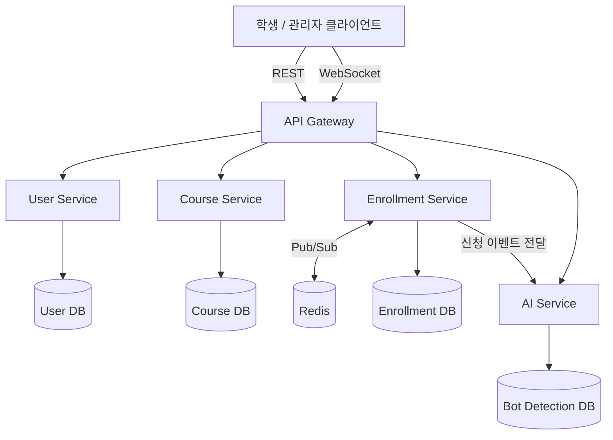

# EnrollGate

> 동시에 수천 명이 몰려도 정원만큼만, 공정하게, 안정적으로 처리하는 수강신청 플랫폼

대학 수강신청 시스템에서 반복적으로 발생하는 트래픽 폭주, 정원 초과 판매(재고 정합성 붕괴), 매크로/봇 남용 문제를 동시성 제어·대기열·캐싱·이상 탐지 기법으로 직접 해결하는 백엔드 프로젝트입니다.

## 문제 정의

- 수강신청 오픈 순간 짧은 시간에 트래픽이 집중되며, 정원 초과 판매·서버 다운·매크로를 이용한 불공정 선점이 반복적으로 발생합니다.
- 단순 CRUD로 구현하면 동시 요청 시 정원 카운터에 Race Condition이 발생해 재고 정합성이 깨집니다.
- 이 프로젝트는 이 문제를 분산 락, 대기열, 캐싱, 이상 탐지 등 실무 기법으로 해결하고, **성능 개선을 정량적으로 증명하는 것**을 목표로 합니다.

## 아키텍처



목표 아키텍처는 User / Course / Enrollment / AI 4개 서비스로 분리된 MSA 구조입니다. 초반(1~2단계)에는 단일 서비스(모놀리식)로 개발하며, 도메인 경계를 패키지 단위로 미리 나눠두고 3단계에서 서비스로 추출합니다. 자세한 설계 근거는 [docs/EnrollGate-Architecture.md](docs/EnrollGate-Architecture.md) 참고.

## 동시성 제어 전략

정원 카운터(`courses.current_enrolled_count`) 갱신 시 Race Condition을 막기 위한 방식을 단계적으로 비교합니다.

| 단계 | 방식 | 목표 |
|---|---|---|
| 1단계 | 비관적 락 (JPA `@Lock(PESSIMISTIC_WRITE)`) | 정합성이 명확한 베이스라인 확보 |
| 2단계 | Redis 원자 연산 (Lua Script) | k6 부하테스트로 A/B 성능 비교, 개선율 수치화 |

### 성능 비교 결과 (2026-07-24, 로컬 환경)

`code/backend/k6/enroll-load-test.js`로 동일 조건(과목당 정원, 동시 요청 수)에서 두 전략을 각각 측정.
전략은 `enrollment.concurrency-strategy` 설정(`pessimistic-lock` | `redis-atomic`)으로 전환한다.

**고경합 조건** (정원 5석 vs 동시 150명, HikariCP pool=50 동일 조건)

| 지표 | 비관적 락 | Redis 원자 연산 | 개선율 |
|---|---|---|---|
| 평균 응답시간 | 482.4ms | 318.3ms | **34.0%↓** |
| p90 | 689.1ms | 565.3ms | 18.0%↓ |
| p95 | 716.2ms | 574.4ms | 19.8%↓ |

**저경합 조건** (정원 20석 vs 동시 100명, HikariCP 기본 pool=10)

| 지표 | 비관적 락 | Redis 원자 연산 |
|---|---|---|
| 평균 응답시간 | 182.1ms | 260.7ms (오히려 느림) |
| p95 | 242.6ms | 751.8ms |

**해석**: Redis 원자 연산은 경합이 심할 때(정원 대비 동시 요청이 훨씬 많을 때)만 확실히 빠르다. 경합이 적으면
Redis 왕복이라는 추가 네트워크 홉 자체가 순수 비용이 되어 오히려 손해다 — DB 행 락 대기 시간이 짧을 때는
"락을 안 거는 이득"보다 "Redis 호출 하나 늘어나는 비용"이 더 크기 때문. 즉 두 전략 중 뭐가 유리한지는
**정원 대비 요청 폭주 정도**에 달려 있다는 것이 이번 실측의 핵심 결론이다.

> 측정 환경: 로컬 포터블 PostgreSQL 17.10 + Redis 5.0.14.1(Windows), 동일 머신. 절대적인 지연시간 수치보다
> "경합 정도에 따라 유불리가 갈린다"는 상대적 패턴에 더 무게를 두고 해석할 것.

## 기술 스택

| 영역 | 선택 |
|---|---|
| 언어/프레임워크 | Java + Spring Boot |
| DB | PostgreSQL |
| 캐시/락/대기열 | Redis |
| 인증 | JWT |
| 실시간 통신 | WebSocket (Spring WebSocket) |
| 봇 탐지 (선택 강화) | Python FastAPI + scikit-learn (Isolation Forest) |
| 부하테스트 | k6 |
| 컨테이너 | Docker |
| CI/CD | GitHub Actions (빌드+테스트+이미지 빌드 자동화) — 실제 배포(AWS)는 범위 밖 |

## 진행 상황

- [x] 1단계: 단일 서비스, 비관적 락 기반 정원 제어, 대기열 기본 구현
- [x] 2단계: k6 부하테스트 → Redis 원자 연산 전환 → A/B 성능 비교, WebSocket 대기열
- [x] 3단계: User/Course/Enrollment/AI 서비스로 MSA 분리 (논리적 분리: Gradle 멀티모듈, 실행은 여전히 단일 프로세스)
- [x] 4단계: AI 봇 탐지 연동 (Redis Streams 비동기 이벤트 + 휴리스틱/Isolation Forest 이중 스코어러)
- [x] 5단계: Docker + GitHub Actions (실제 AWS 배포는 범위 밖으로 확정)

### 1단계 구현 현황

- 회원가입/로그인(JWT), 과목 조회(학기/학과 필터), 관리자 과목 등록/수정
- 수강신청 API — `courses.findByIdForUpdate`의 `SELECT ... FOR UPDATE`(비관적 락)로 정원 카운터 갱신을 직렬화
- 정원 초과 시 즉시 실패 대신 **대기열 자동 진입**(202 QUEUED). 대기열은 Redis Sorted Set이 아닌 `waiting_queue` 테이블 기반(DB 폴링 수준)이며, 만료 처리는 5초 주기 스케줄러(`QueueExpirySweeper`)가 담당
- 신청 취소 시 대기열 맨 앞 순번을 같은 트랜잭션 안에서 즉시 승격(다음 순번에게 확정 창구 오픈)
- 동시 신청 시 정원 초과 판매가 발생하지 않음을 증명하는 동시성 테스트 포함(`EnrollmentConcurrencyTest`)

### 2단계 구현 현황

- **정원 카운터 동시성 전략 전환 가능**: `enrollment.concurrency-strategy=pessimistic-lock|redis-atomic` 설정으로 전환. 두 전략 모두 `EnrollmentReservationStrategy` 인터페이스의 별도 구현체(`@ConditionalOnProperty`로 택일)이며, 기본값은 1단계와 동일한 `pessimistic-lock` — 즉 설정을 바꾸지 않으면 기존 동작 그대로 유지된다
- Redis 전략은 Lua `EVAL`(`scripts/reserve_seat.lua`)로 "잔여 정원 확인 + 증가"를 원자 처리하고, DB에는 단일 원자 `UPDATE`로 반영(선행 SELECT 없음). 카운터가 없는 신규 과목은 DB 값으로 자동 시딩(lazy self-heal)
- 취소/만료(cancel/confirmQueue/expireOverdueQueueEntries)는 전략과 무관하게 항상 비관적 락 경로를 사용 — Redis 전략 활성 중 취소가 발생하면 Redis 카운터가 실제보다 커진 채로 남을 수 있다는 트레이드오프를 문서화함(README 성능 비교 절 참고)
- k6 A/B 부하테스트로 실측(아래 성능 비교 결과 참고), 실제 로컬 Redis(포터블)로 Lua 스크립트 원자성 자체도 동시성 테스트로 검증(`RedisSeatGateIntegrationTest`)
- **WebSocket 대기열 push** (`/ws/queue/{courseId}?token=`) — 승격 시 `YOUR_TURN`, 만료 시 `EXPIRED`, 순번 변동 시 남은 대기자 전원에게 `POSITION_UPDATE` 브로드캐스트. 기존 폴링 API(`GET /queue/status`)는 폴백으로 계속 유지. 실제 임베디드 서버에 진짜 WebSocket 연결을 맺어 검증(`QueueWebSocketFlowTest`). 단일 인스턴스 기준 구현 — 멀티 인스턴스 간 이벤트 동기화(Redis Pub/Sub)는 3단계 이후 과제

### 3단계 구현 현황

- **Gradle 멀티모듈로 분리** — `common`, `user-service`, `course-service`, `enrollment-service`, `ai-service`(4단계 스캐폴드), `app`(실행 가능한 조립 지점, `EnrollgateApplication`/`application.yml`/Flyway 마이그레이션 소유). 모노레포는 유지하되(Repo-Strategy 문서 결정), 모듈 경계로 컴파일 타임에 서비스 경계를 강제한다
- **enrollment-service ↔ course-service 순환 의존 없음** — `common.contract` 패키지에 `CourseCapacityPort`(enrollment→course, 정원 예약/반납), `QueueLengthPort`(course→enrollment, 대기열 길이 조회) 두 포트 인터페이스를 두고, 각 서비스는 자기 도메인의 실제 구현(어댑터)만 제공한다. enrollment-service는 `Course` 엔티티/리포지토리를 전혀 참조하지 않는다
- 정원 카운터 관리(`EnrollmentReservationStrategy` 두 구현체)는 `PessimisticLockCourseCapacityAdapter`/`RedisAtomicCourseCapacityAdapter`로 course-service에 재배치 — 두 전략 모두 `CourseCapacityPort`를 구현하며, 여전히 `enrollment.concurrency-strategy` 설정으로 전환된다
- **버그 발견 및 수정**: 포트 분리 과정에서 `EnrollmentService.enroll()`이 (잠금 없는) `getSnapshot()`을 호출한 뒤 곧이어 (잠금 있는) 예약 시도를 하도록 짰더니, 동시성 테스트(`EnrollmentConcurrencyTest`)가 정원 3석에 15건 전부 성공으로 실패했다 — Hibernate 1차 캐시 때문에 같은 트랜잭션 안에서 먼저 읽은 엔티티가 있으면 뒤이은 잠금 조회가 실제 DB 락으로 이어지지 않은 것. `attemptReservation()` 하나로 스냅샷 확인과 예약을 원자적으로 합쳐 해결했다 (`CourseCapacityPort` 문서 참고)

### 4단계 구현 현황

- **비동기 봇 탐지 파이프라인**: `EnrollmentController`가 매 신청 시도(성공/큐잉/이미신청 등 모든 결과)마다 User-Agent와 함께 `EnrollEventPublisher`로 이벤트를 fire-and-forget 발행 — 실패해도 예외를 던지지 않아 신청 처리 자체는 절대 지연/차단되지 않는다. 메시지 큐는 **Redis Streams**(`enrollgate:enroll-events`)로 확정(Kafka 대비 로컬 인프라 최소화). `ai-service`의 `EnrollEventConsumer`가 Consumer Group(`XREADGROUP`)으로 5초 주기 폴링하며, 개별 레코드 처리가 실패해도 반드시 ack해 poison message가 파이프라인을 막지 않도록 함
- **이중 스코어러**: 기본값은 규칙 기반 `HeuristicBotDetectionScorer`(요청 간격<1초, 1분 내 반복≥5회, 의심스러운 UA에 가중치 부여). `ai.scorer=isolation-forest` 설정 시 별도 Python(FastAPI + scikit-learn IsolationForest) 서비스로 스코어링을 위임하는 `PythonModelBotDetectionScorer`로 전환 가능(`@ConditionalOnProperty` 택일). Python 서비스가 꺼져 있거나 응답 실패 시 자동으로 휴리스틱 폴백 — 봇 탐지는 부가 기능이라 이 경로가 신청 자체를 막으면 안 된다는 원칙
- `GET /api/v1/admin/bot-detection/logs` — 최신 50건의 탐지 로그 조회 (Admin 전용)
- **버그 발견 및 수정 (1) — Java→Python HTTP 422**: `RestTemplate`로 FastAPI `/score`를 호출할 때마다 curl로는 성공하는 동일 페이로드가 Java에서만 `"Field required": "body"` 422로 실패했다. `ai-service` 클래스패스에 Apache HttpClient/OkHttp/Jetty가 전혀 없어 Spring Boot의 `RestTemplateBuilder`가 JDK `java.net.http.HttpClient` 기반 팩토리를 기본 선택했는데, 이 클라이언트는 평문 HTTP에도 기본적으로 HTTP/2 cleartext(h2c) 업그레이드를 시도하고, uvicorn(h11)이 이를 이해하지 못해 커넥션을 오염시키는 것이 원인이었다. `RestTemplateBuilder.requestFactory(SimpleClientHttpRequestFactory::new)`로 구식 HTTP/1.1 전용 팩토리를 명시적으로 강제해 해결
- **버그 발견 및 수정 (2) — IsolationForest 학습 분포 버그**: "이전 요청 없음"을 나타내는 Java 쪽 sentinel 값(`interval_seconds=-1.0`)이 Python 모델의 학습 데이터(전부 "이전 요청이 있던" 2~60초 구간)에는 전혀 없는 극단치라서, 실제 봇 신호(반복횟수/UA)와 무관하게 모든 첫 신청을 무조건 이상치로 판정하는 문제가 있었다. 학습 데이터에 "정상적인 첫 신청" 샘플을 추가해 sentinel 값 자체가 이상치가 되지 않도록 보정 — 이후 정상 첫 신청(미탐지) vs 짧은 간격 반복+의심 UA(FLAGGED)가 명확히 구분됨을 실측으로 확인
- 실제 Postgres/Redis/Python 3개 프로세스를 모두 띄워 검증: 봇 의심 사용자가 짧은 간격으로 6회 연속 신청 시도 시 매번 `suspicionScore≈0.57`, `actionTaken=FLAGGED`로 정확히 탐지됨

### 5단계 구현 현황

- **Dockerfile** (`code/backend/app/Dockerfile`) — 멀티 스테이지 빌드: `eclipse-temurin:21-jdk-jammy`에서 `:app:bootJar`를 빌드하고, 최종 이미지는 `eclipse-temurin:21-jre-jammy`(JDK 아닌 JRE)에 jar 파일만 복사해 이미지 크기를 줄인다
- **docker-compose 앱 서비스 추가** — 기존 `postgres`/`redis`에 healthcheck를 추가하고, `app`이 `depends_on: condition: service_healthy`로 두 인프라가 준비된 뒤에만 시작하도록 구성. 4단계의 선택적 강화 스코어러인 `ai-model`(Python FastAPI) 서비스도 함께 추가했으나 필수는 아님(꺼져 있으면 자동 휴리스틱 폴백)
- **GitHub Actions** (`.github/workflows/ci.yml`, 저장소 루트) — `build-and-test` 잡이 JDK 21로 `./gradlew test`를 실행(H2 인메모리 DB라 외부 인프라 불필요), 이어서 `docker-build` 잡이 앱/ai-model 두 이미지를 실제로 빌드해본다. **주의**: `.github/workflows/`는 반드시 저장소 루트에 있어야 GitHub Actions가 인식하므로 `code/backend`가 아닌 루트에 위치시켰다
- **AWS 배포는 범위 밖으로 확정** — 졸업 전 학습/포트폴리오 목적 프로젝트라 Dockerfile/CI 작성까지가 5단계의 실질적 완료 기준. 로컬에는 Docker가 설치되어 있지 않아(WSL2/Docker 미설치 결정 유지) `docker build` 자체의 로컬 검증은 불가능했지만, **실제 GitHub Actions push로 검증 완료** — `build-and-test`(137개 테스트) + `docker-build`(app/ai-model 이미지) 두 잡 모두 success
- **버그 발견 및 수정 (3) — CI 전용 테스트 실패**: 로컬은 항상 Redis가 떠 있어 몰랐지만, Redis가 없는 GitHub Actions 러너에서 `EnrollEventPublisherTest` 4개가 `RedisConnectionFailureException`으로 실패했다. `@BeforeEach`의 `assumeTrue`가 Redis 연결 실패 시 테스트를 스킵시키지만, **JUnit5는 `@BeforeEach` assumption이 실패해도 `@AfterEach`는 여전히 실행한다**는 점 때문에 `tearDown()`이 무조건 Redis를 호출하다 스킵됐어야 할 테스트가 실패로 둔갑했다. `redisReachable` 플래그로 `tearDown()`도 가드해 해결 — 로컬 Redis를 일부러 내려 재현 후 재검증 완료

```
cd code/backend
docker-compose up -d        # PostgreSQL, Redis (로컬 실행용 — 테스트는 H2로 대체 실행됨)
./gradlew :app:bootRun
./gradlew test              # 전체 모듈 테스트 실행 (H2 인메모리 DB 사용)
```

**Docker 없이 로컬에서 띄우기**: Docker가 없어도 포터블 바이너리로 동일하게 실행할 수 있다 (설치 마법사 없이 zip만 받아서 실행).

```
# Redis (설치 없이 실행)
<redis 압축 해제 폴더>/redis-server.exe redis.windows.conf --port 6379

# PostgreSQL (최초 1회만 initdb)
<pgsql 압축 해제 폴더>/bin/initdb.exe -D data -U enrollgate --pwfile=pwfile
<pgsql 압축 해제 폴더>/bin/pg_ctl.exe -D data -l pg.log -o "-p 5432" start
<pgsql 압축 해제 폴더>/bin/createdb.exe -h localhost -p 5432 -U enrollgate enrollgate

# k6 (winget으로 설치, 재사용 가능)
winget install GrafanaLabs.k6
```
`docker-compose.yml`의 `POSTGRES_USER=enrollgate / POSTGRES_PASSWORD=enrollgate / POSTGRES_DB=enrollgate`와 동일한 계정으로 맞추면 `application.yml` 수정 없이 그대로 붙는다.

## 수동 테스트용 프론트엔드 (`code/frontend`)

이 프로젝트는 **백엔드 API 전용**이며(README 상단 참고), `code/frontend`는 포트폴리오 산출물이 아니라 브라우저에서 직접 눈으로 확인하며 API를 수동 테스트하기 위한 순수 HTML/CSS/JS 페이지다. 빌드 도구나 프레임워크 없이 정적 파일 그대로 동작한다.

```
# 1) 백엔드 (별도 터미널)
cd code/backend
./gradlew :app:bootRun

# 2) 프론트엔드 정적 서버 (별도 터미널) — file://로 직접 열면 CORS Origin이 "null"이 되어 막히므로 반드시 서버로 서빙
cd code/frontend
python -m http.server 5500
```

브라우저에서 `http://localhost:5500` 접속. 회원가입/로그인/과목 목록/수강신청/대기열/내 신청내역까지 바로 되고, 관리자 기능(과목 등록, 봇 탐지 로그)은 회원가입만으로는 권한이 없어 DB에서 직접 승격이 필요하다:

```
psql -U enrollgate -h localhost -d enrollgate -c "UPDATE users SET role='ADMIN' WHERE email='본인이메일';"
```

백엔드의 `SecurityConfig`에 `http://localhost:*`/`http://127.0.0.1:*` 출처를 허용하는 CORS 설정을 추가해 이 프론트엔드가 다른 포트에서도 API를 호출할 수 있게 했다 (Authorization 헤더로만 인증하므로 `allowCredentials`는 false).

## 문서

- [PRD](docs/EnrollGate-PRD.md) — 요구사항 명세 (기능/비기능 요구사항, 로드맵)
- [ERD & API 명세](docs/EnrollGate-ERD-API-Spec.md)
- [아키텍처 설계](docs/EnrollGate-Architecture.md) — 서비스 분리 기준, 동시성 제어 전략 비교
- [저장소 구조 & 브랜치 전략](docs/EnrollGate-Repo-Strategy.md)
- [개발 계획 (1~5단계 로드맵)](docs/EnrollGate-Roadmap.md) — 단계별 실행 계획, 환경 제약과 대응 방안
