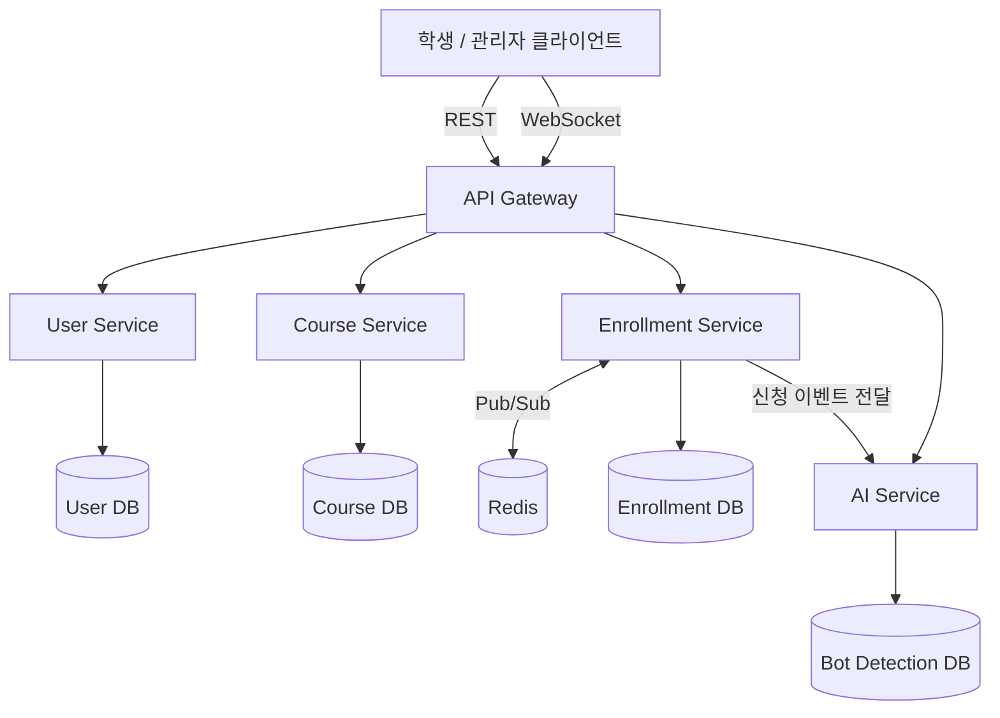

# EnrollGate

> 동시에 수천 명이 몰려도 정원만큼만, 공정하게, 안정적으로 처리하는 수강신청 플랫폼

대학 수강신청 시스템에서 반복적으로 발생하는 트래픽 폭주, 정원 초과 판매(재고 정합성 붕괴), 매크로/봇 남용 문제를 동시성 제어·대기열·캐싱·이상 탐지 기법으로 직접 해결하는 백엔드 프로젝트입니다.

## 문제 정의

- 수강신청 오픈 순간 짧은 시간에 트래픽이 집중되며, 정원 초과 판매·서버 다운·매크로를 이용한 불공정 선점이 반복적으로 발생합니다.
- 단순 CRUD로 구현하면 동시 요청 시 정원 카운터에 Race Condition이 발생해 재고 정합성이 깨집니다.
- 이 프로젝트는 이 문제를 분산 락, 대기열, 캐싱, 이상 탐지 등 실무 기법으로 해결하고, **성능 개선을 정량적으로 증명하는 것**을 목표로 합니다.

## 아키텍처



목표 아키텍처는 User / Course / Enrollment / AI 4개 서비스로 분리된 MSA 구조입니다. 초반(1~2단계)에는 단일 서비스(모놀리식)로 개발하며, 도메인 경계를 패키지 단위로 미리 나눠두고 3단계에서 서비스로 추출합니다. 자세한 설계 근거는 [docs/EnrollGate-Architecture.md](docs/EnrollGate-Architecture.md) 참고.

## 동시성 제어 전략

정원 카운터(`courses.current_enrolled_count`) 갱신 시 Race Condition을 막기 위한 방식을 단계적으로 비교합니다.

| 단계 | 방식 | 목표 |
|---|---|---|
| 1단계 | 비관적 락 (JPA `@Lock(PESSIMISTIC_WRITE)`) | 정합성이 명확한 베이스라인 확보 |
| 2단계 | Redis 원자 연산 (Lua Script) | k6 부하테스트로 A/B 성능 비교, 개선율 수치화 |

> 성능 비교 결과는 2단계 진행 후 이 섹션에 추가할 예정입니다.

## 기술 스택

| 영역 | 선택 |
|---|---|
| 언어/프레임워크 | Java + Spring Boot |
| DB | PostgreSQL |
| 캐시/락/대기열 | Redis |
| 인증 | JWT |
| 실시간 통신 | WebSocket (Spring WebSocket) |
| 부하테스트 | k6 |
| 컨테이너 | Docker |
| CI/CD | GitHub Actions → AWS (ECS/EKS) |

## 진행 상황

- [x] 1단계: 단일 서비스, 비관적 락 기반 정원 제어, 대기열 기본 구현
- [ ] 2단계: k6 부하테스트 → Redis 원자 연산 전환 → A/B 성능 비교, WebSocket 대기열
- [ ] 3단계: User/Course/Enrollment/AI 서비스로 MSA 분리
- [ ] 4단계: AI 봇 탐지 연동
- [ ] 5단계: Docker + GitHub Actions + AWS 배포

### 1단계 구현 현황

- 회원가입/로그인(JWT), 과목 조회(학기/학과 필터), 관리자 과목 등록/수정
- 수강신청 API — `courses.findByIdForUpdate`의 `SELECT ... FOR UPDATE`(비관적 락)로 정원 카운터 갱신을 직렬화
- 정원 초과 시 즉시 실패 대신 **대기열 자동 진입**(202 QUEUED). 대기열은 아직 Redis Sorted Set이 아닌 `waiting_queue` 테이블 기반(DB 폴링 수준)이며, 만료 처리는 5초 주기 스케줄러(`QueueExpirySweeper`)가 담당
- 신청 취소 시 대기열 맨 앞 순번을 같은 트랜잭션 안에서 즉시 승격(다음 순번에게 확정 창구 오픈)
- 동시 신청 시 정원 초과 판매가 발생하지 않음을 증명하는 동시성 테스트 포함(`EnrollmentConcurrencyTest`)
- WebSocket 대기열 알림, Redis 원자 연산 전환, k6 부하테스트는 2단계 과제로 남아 있음

```
cd code/backend
docker-compose up -d        # PostgreSQL, Redis (로컬 실행용 — 테스트는 H2로 대체 실행됨)
./gradlew bootRun
./gradlew test              # 단위/동시성/API 테스트 전체 실행 (H2 인메모리 DB 사용)
```

## 문서

- [PRD](docs/EnrollGate-PRD.md) — 요구사항 명세 (기능/비기능 요구사항, 로드맵)
- [ERD & API 명세](docs/EnrollGate-ERD-API-Spec.md)
- [아키텍처 설계](docs/EnrollGate-Architecture.md) — 서비스 분리 기준, 동시성 제어 전략 비교
- [저장소 구조 & 브랜치 전략](docs/EnrollGate-Repo-Strategy.md)
