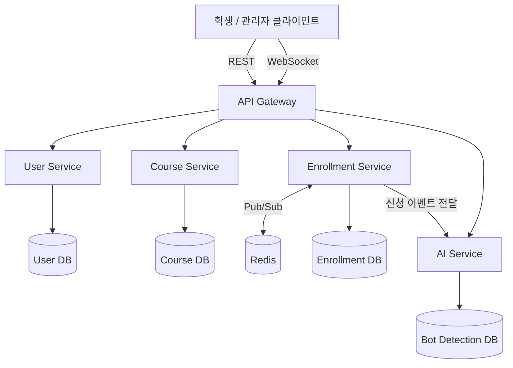

# EnrollGate — 아키텍처 설계

> Status: Draft v0.1 (ERD/API 명세 v0.1 기준)
> 기술 스택: Java + Spring Boot (기본값, 필요 시 Kotlin 전환 가능)

---

## 1. 전체 서비스 구조 (Target MSA)

> MVP 단계에서는 이 4개 서비스를 처음부터 나누지 않고, **PRD 로드맵 1~2단계까지는 단일 서비스(모놀리식)**로 개발한 뒤 3단계에서 분리합니다. 초반부터 MSA로 쪼개면 서비스 간 통신 오버헤드 때문에 핵심 로직(동시성 제어) 검증이 늦어져요.

---

## 2. 서비스별 책임 분리 기준

| 서비스 | 책임 | DB 소유 | 분리 근거 |
|---|---|---|---|
| **User Service** | 회원가입, 로그인, JWT 발급/검증 | Users | 인증은 다른 도메인과 독립적으로 스케일링 가능해야 함 |
| **Course Service** | 과목 CRUD, 학기별 조회 | Courses | 읽기 위주 트래픽, 캐싱 적용 지점이 명확히 분리됨 |
| **Enrollment Service** | 신청/취소, 정원 카운터 관리, 대기열, WebSocket | Enrollments, Waiting Queue | **프로젝트의 핵심.** 쓰기 트래픽이 집중되는 지점이라 독립적으로 스케일 아웃해야 함 |
| **AI Service** | 봇 탐지, 이상 트래픽 스코어링 | Bot Detection Logs | 연산 성격이 달라(ML 추론) 별도 리소스(예: GPU 불필요하지만 CPU 집약적 배치)로 분리 |

> **왜 이 기준인가**: "트래픽 패턴이 다른 도메인을 분리한다"는 원칙을 따랐습니다. Enrollment는 쓰기가 집중되는 핫스팟, Course는 읽기 위주, User는 인증이라는 독립적 관심사, AI는 연산 특성이 전혀 다른 워크로드입니다. 단순히 "테이블 개수만큼 서비스를 쪼갠 것"이 아니라는 점을 설명할 수 있어야 합니다.

---

## 3. 동시성 제어 전략 비교 (핵심 설계 지점)

정원 카운터(`courses.current_enrolled_count`) 갱신 시 Race Condition을 막는 3가지 방식을 비교합니다.

| 방식 | 구현 | 장점 | 단점 |
|---|---|---|---|
| **A. 비관적 락 (Pessimistic Lock)** | JPA `@Lock(PESSIMISTIC_WRITE)` → `SELECT ... FOR UPDATE` | 구현 간단, 정합성 보장 명확 | 락 대기로 인한 처리량 저하, DB 커넥션 풀 고갈 위험 |
| **B. Redis 원자 연산 (Lua Script)** | `EVAL` 스크립트로 "잔여 정원 확인 + 감소"를 원자적으로 처리 | 매우 빠름(인메모리), DB 부하 없음 | DB와의 최종 정합성을 별도로 맞춰야 함(비동기 반영 필요) |
| **C. 분산 락 (Redisson)** | 과목 단위 락(`RLock`)으로 임계 구역 보호 | 애플리케이션 로직 유연하게 작성 가능 | 락 자체가 직렬화 지점이 되어 처리량 제한, 네트워크 왕복 비용 |

### 채택 방향
- **1단계(MVP)**: A(비관적 락)로 먼저 구현 — 가장 이해하기 쉽고 정합성이 명확해서 베이스라인으로 삼기 좋음
- **2단계(성능 개선)**: B(Redis 원자 연산)로 전환 후 **A와 B를 동일 조건에서 부하테스트로 비교**
- 이 비교 자체가 프로젝트의 핵심 성능 스토리가 됩니다. ("비관적 락 환경에서 X TPS → Redis 원자 연산 전환 후 Y TPS, Z% 개선")
- C(분산 락)는 대기열 확정 처리(`queue/confirm`)처럼 복잡한 비즈니스 로직이 임계 구역에 필요한 경우에 한정적으로 사용 고려

---

## 4. Redis의 3가지 용도 (명확히 구분해서 설명할 것)

같은 Redis를 쓰더라도 용도가 다르다는 걸 명확히 구분해야 설계 의도가 잘 전달됩니다.

1. **동시성 제어**: 정원 카운터 원자 연산 (Lua Script)
2. **대기열 관리**: Sorted Set으로 순번 관리 (score = 진입 timestamp)
3. **캐싱**: 과목 목록 조회 API 응답 캐싱 (Course Service, TTL 기반)

---

## 5. 서비스 간 통신 방식

| 통신 | 방식 | 이유 |
|---|---|---|
| Enrollment → AI Service | 비동기 (메시지 큐: Kafka 또는 Redis Streams) | 봇 탐지가 신청 처리 자체를 지연시키면 안 됨 |
| GW → User/Course/Enrollment | 동기 REST | 클라이언트 요청-응답 흐름상 즉시 답이 필요 |
| Enrollment 서비스 간 WebSocket 이벤트 동기화 | Redis Pub/Sub | 여러 인스턴스에 분산된 WebSocket 커넥션에 순번 갱신을 broadcast |

---

## 6. 기술 스택 정리

| 영역 | 선택 | 비고 |
|---|---|---|
| 언어/프레임워크 | Java + Spring Boot | 국내 채용 시장 표준 |
| DB | PostgreSQL | 트랜잭션/락 기능이 검증된 RDBMS |
| 캐시/락/대기열 | Redis | 다목적 활용 (위 3가지 용도) |
| 메시지 큐 | Kafka 또는 Redis Streams | AI Service 비동기 연동 (MVP는 Redis Streams로 간소화 가능) |
| 인증 | JWT | Stateless, MSA 환경에 적합 |
| 실시간 통신 | WebSocket (Spring WebSocket) | 대기열 순번 push |
| 부하 테스트 | k6 | 시나리오 기반 부하 생성, 성능 비교 |
| 컨테이너 | Docker | 서비스별 독립 배포 단위 |
| CI/CD | GitHub Actions | 테스트 자동화 → 이미지 빌드 → 배포 |
| 배포 | AWS (ECS 또는 EKS) | PRD 5단계 로드맵 |

---

## 7. 로드맵 재확인 (PRD 8번과 연결)

| 단계 | 아키텍처 관점에서 할 일 |
|---|---|
| 1단계 | 단일 서비스, 비관적 락 기반 정원 제어, 대기열 기본 구현(DB 폴링 수준) |
| 2단계 | k6 부하테스트 → Redis 원자 연산 전환 → A/B 성능 비교, WebSocket 도입 |
| 3단계 | User/Course/Enrollment 서비스 분리, API Gateway 도입 |
| 4단계 | AI Service 분리, 비동기 메시지 큐 연동 |
| 5단계 | Docker + GitHub Actions + AWS 배포 |

---

## 8. Open Questions

- [ ] API Gateway 자체 구현 vs 기성 솔루션(Spring Cloud Gateway) 사용 여부
- [ ] Kafka vs Redis Streams — MVP 단계 리소스/러닝커브 고려하여 최종 확정 필요
- [ ] 서비스별 DB를 처음부터 물리적으로 분리할지, 3단계 전까지는 스키마만 논리적으로 분리할지
- [x] 확정 대기 시간 내 미확정 시 다음 순번 이전 로직의 트리거 방식: **스케줄러로 확정** — `QueueExpirySweeper`가 5초 주기로 만료된 `NOTIFIED` 항목을 스캔해 다음 순번을 승격한다 (1단계, DB 폴링 수준). 이벤트 기반 전환은 Redis 도입 시(2단계) 재검토

### 1단계 구현 메모

- 정원 카운터(`currentEnrolledCount`)는 "확정 신청 + 확정 대기 중(NOTIFIED) 예약"의 합으로 취급한다. 즉 좌석이 비어도 대기자가 있으면 카운트를 그대로 유지한 채 다음 사람에게 승격만 하고, 대기자가 없을 때만 실제로 감소시킨다. 이렇게 하면 신규 신청(`enroll`)과 좌석 반납(`cancel`/만료)이 모두 같은 course row 비관적 락 한 곳으로 직렬화된다.
- Java 툴체인은 로컬 개발 환경에 설치된 JDK가 21뿐이라 `build.gradle`의 `languageVersion`을 17 → 21로 조정했다 (Spring Boot 3.5 기준 호환).
