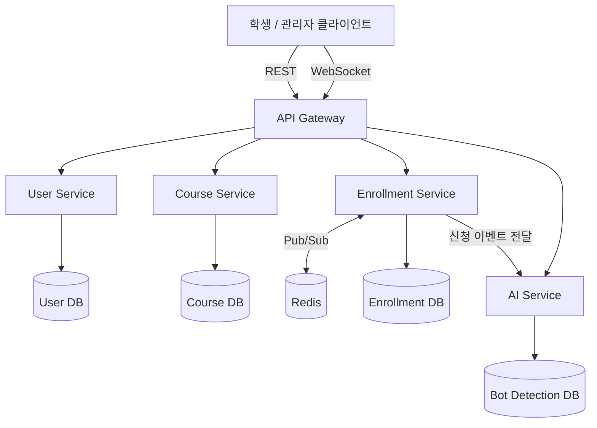

# EnrollGate — 아키텍처 설계

> Status: Draft v0.1 (ERD/API 명세 v0.1 기준)
> 기술 스택: Java + Spring Boot (기본값, 필요 시 Kotlin 전환 가능)

---

## 1. 전체 서비스 구조 (Target MSA)

> MVP 단계에서는 이 4개 서비스를 처음부터 나누지 않고, **PRD 로드맵 1~2단계까지는 단일 서비스(모놀리식)**로 개발한 뒤 3단계에서 분리합니다. 초반부터 MSA로 쪼개면 서비스 간 통신 오버헤드 때문에 핵심 로직(동시성 제어) 검증이 늦어져요.

---

## 2. 서비스별 책임 분리 기준

| 서비스 | 책임 | DB 소유 | 분리 근거 |
|---|---|---|---|
| **User Service** | 회원가입, 로그인, JWT 발급/검증 | Users | 인증은 다른 도메인과 독립적으로 스케일링 가능해야 함 |
| **Course Service** | 과목 CRUD, 학기별 조회 | Courses | 읽기 위주 트래픽, 캐싱 적용 지점이 명확히 분리됨 |
| **Enrollment Service** | 신청/취소, 정원 카운터 관리, 대기열, WebSocket | Enrollments, Waiting Queue | **프로젝트의 핵심.** 쓰기 트래픽이 집중되는 지점이라 독립적으로 스케일 아웃해야 함 |
| **AI Service** | 봇 탐지, 이상 트래픽 스코어링 | Bot Detection Logs | 연산 성격이 달라(ML 추론) 별도 리소스(예: GPU 불필요하지만 CPU 집약적 배치)로 분리 |

> **왜 이 기준인가**: "트래픽 패턴이 다른 도메인을 분리한다"는 원칙을 따랐습니다. Enrollment는 쓰기가 집중되는 핫스팟, Course는 읽기 위주, User는 인증이라는 독립적 관심사, AI는 연산 특성이 전혀 다른 워크로드입니다. 단순히 "테이블 개수만큼 서비스를 쪼갠 것"이 아니라는 점을 설명할 수 있어야 합니다.

---

## 3. 동시성 제어 전략 비교 (핵심 설계 지점)

정원 카운터(`courses.current_enrolled_count`) 갱신 시 Race Condition을 막는 3가지 방식을 비교합니다.

| 방식 | 구현 | 장점 | 단점 |
|---|---|---|---|
| **A. 비관적 락 (Pessimistic Lock)** | JPA `@Lock(PESSIMISTIC_WRITE)` → `SELECT ... FOR UPDATE` | 구현 간단, 정합성 보장 명확 | 락 대기로 인한 처리량 저하, DB 커넥션 풀 고갈 위험 |
| **B. Redis 원자 연산 (Lua Script)** | `EVAL` 스크립트로 "잔여 정원 확인 + 감소"를 원자적으로 처리 | 매우 빠름(인메모리), DB 부하 없음 | DB와의 최종 정합성을 별도로 맞춰야 함(비동기 반영 필요) |
| **C. 분산 락 (Redisson)** | 과목 단위 락(`RLock`)으로 임계 구역 보호 | 애플리케이션 로직 유연하게 작성 가능 | 락 자체가 직렬화 지점이 되어 처리량 제한, 네트워크 왕복 비용 |

### 채택 방향
- **1단계(MVP)**: A(비관적 락)로 먼저 구현 — 가장 이해하기 쉽고 정합성이 명확해서 베이스라인으로 삼기 좋음
- **2단계(성능 개선)**: B(Redis 원자 연산)로 전환 후 **A와 B를 동일 조건에서 부하테스트로 비교**
- 이 비교 자체가 프로젝트의 핵심 성능 스토리가 됩니다. ("비관적 락 환경에서 X TPS → Redis 원자 연산 전환 후 Y TPS, Z% 개선")
- C(분산 락)는 대기열 확정 처리(`queue/confirm`)처럼 복잡한 비즈니스 로직이 임계 구역에 필요한 경우에 한정적으로 사용 고려

---

## 4. Redis의 3가지 용도 (명확히 구분해서 설명할 것)

같은 Redis를 쓰더라도 용도가 다르다는 걸 명확히 구분해야 설계 의도가 잘 전달됩니다.

1. **동시성 제어**: 정원 카운터 원자 연산 (Lua Script)
2. **대기열 관리**: Sorted Set으로 순번 관리 (score = 진입 timestamp)
3. **캐싱**: 과목 목록 조회 API 응답 캐싱 (Course Service, TTL 기반)

---

## 5. 서비스 간 통신 방식

| 통신 | 방식 | 이유 |
|---|---|---|
| Enrollment → AI Service | 비동기 (**Redis Streams**로 확정, 4단계 구현 완료) | 봇 탐지가 신청 처리 자체를 지연시키면 안 됨 |
| GW → User/Course/Enrollment | 동기 REST | 클라이언트 요청-응답 흐름상 즉시 답이 필요 |
| Enrollment 서비스 간 WebSocket 이벤트 동기화 | Redis Pub/Sub | 여러 인스턴스에 분산된 WebSocket 커넥션에 순번 갱신을 broadcast |

---

## 6. 기술 스택 정리

| 영역 | 선택 | 비고 |
|---|---|---|
| 언어/프레임워크 | Java + Spring Boot | 국내 채용 시장 표준 |
| DB | PostgreSQL | 트랜잭션/락 기능이 검증된 RDBMS |
| 캐시/락/대기열 | Redis | 다목적 활용 (위 3가지 용도) |
| 메시지 큐 | Redis Streams (확정) | AI Service 비동기 연동 — 이미 Redis 인프라를 쓰고 있어 Kafka 없이 Consumer Group으로 충분히 구현 |
| 인증 | JWT | Stateless, MSA 환경에 적합 |
| 실시간 통신 | WebSocket (Spring WebSocket) | 대기열 순번 push |
| 부하 테스트 | k6 | 시나리오 기반 부하 생성, 성능 비교 |
| 컨테이너 | Docker | 서비스별 독립 배포 단위 |
| CI/CD | GitHub Actions | 테스트 자동화 → Docker 이미지 빌드까지 (5단계 구현 완료). 실배포는 범위 밖 |
| 배포 | ~~AWS (ECS 또는 EKS)~~ | **범위 밖으로 확정** — 졸업 전 포트폴리오 프로젝트라 실제 배포 계획 없음 |

---

## 7. 로드맵 재확인 (PRD 8번과 연결)

| 단계 | 아키텍처 관점에서 할 일 |
|---|---|
| 1단계 | 단일 서비스, 비관적 락 기반 정원 제어, 대기열 기본 구현(DB 폴링 수준) |
| 2단계 | k6 부하테스트 → Redis 원자 연산 전환 → A/B 성능 비교, WebSocket 도입 |
| 3단계 | User/Course/Enrollment 서비스 분리(**Gradle 멀티모듈로 논리적 분리 완료**, 실제 프로세스/DB 물리 분리와 API Gateway는 범위 밖으로 확정 — 아래 3단계 구현 메모 참고) |
| 4단계 | AI Service 분리, 비동기 메시지 큐 연동 (**완료** — Redis Streams + 휴리스틱/Isolation Forest 이중 스코어러, 아래 4단계 구현 메모 참고) |
| 5단계 | Docker + GitHub Actions + AWS 배포 |

---

## 8. Open Questions

- [x] API Gateway 자체 구현 vs 기성 솔루션 사용 여부: **범위 밖으로 확정** — 물리적으로 분리된 서비스가 없으므로(단일 프로세스) Gateway 자체가 불필요해짐
- [x] Kafka vs Redis Streams — **Redis Streams로 확정** (Consumer Group으로 재시작 후에도 미처리 이벤트를 잃지 않음, 별도 인프라 추가 없이 기존 Redis 재사용)

---

## 9. 4단계 구현 메모 — AI 봇 탐지 연동

### 이벤트 흐름
`EnrollmentController` → (신청 성공/큐잉/이미신청 등 모든 결과에서) `EnrollEventPublisher.publish()` → Redis Stream `enrollgate:enroll-events` → `ai-service`의 `EnrollEventConsumer`가 Consumer Group(`ai-service`)으로 5초 주기 `XREADGROUP` 폴링 → `BotDetectionScorer.score()` → `bot_detection_logs` 테이블에 저장. Publisher는 어떤 예외도 던지지 않으며(try-catch로 완전히 감쌈), Consumer는 개별 레코드 처리가 실패해도 무조건 ack해 하나의 실패 레코드가 파이프라인 전체를 막는(poison message) 상황을 방지한다.

### 스코어러 전략 (2번째 `@ConditionalOnProperty` 택일 패턴)
2단계의 `EnrollmentReservationStrategy`(pessimistic-lock/redis-atomic)와 동일한 설계 원칙 — 인터페이스(`BotDetectionScorer`) + 설정 기반 구현체 택일:
- **기본값 `heuristic`**: 요청 간격<1초(+0.4), 1분 내 반복≥5회(+0.3), User-Agent 이상치(+0.3) 가중합, 0.6 이상이면 `FLAGGED`. 외부 의존성 없이 항상 동작
- **`isolation-forest`**: `code/ai-model`(FastAPI + scikit-learn)에 HTTP로 위임. 이 서비스가 꺼져 있거나 응답 실패 시 예외를 잡아 즉시 휴리스틱으로 폴백 — 봇 탐지는 부가 기능이므로 이 경로가 신청 자체에 영향을 줘서는 안 된다는 원칙을 지킴

### 겪은 문제와 해결
- **Java→Python HTTP 422 (`RestTemplate` vs uvicorn)**: 동일 JSON 페이로드가 curl로는 200 OK인데 `RestTemplate.postForObject()`로는 매번 422 `"Field required": "body"`가 났다. uvicorn 로그의 `Unsupported upgrade request` 경고가 단서. `ai-service`의 클래스패스에 Apache HttpClient5/OkHttp/Jetty가 전혀 없어, Spring Boot `RestTemplateBuilder.build()`의 `ClientHttpRequestFactories` 자동 탐지가 **JDK `java.net.http.HttpClient` 기반 팩토리**로 귀결됐다. 이 클라이언트는 평문(cleartext) HTTP 요청에도 기본적으로 HTTP/2 업그레이드(h2c)를 시도하는데, uvicorn의 h11 파서는 이 업그레이드 요청 자체를 이해하지 못해 커넥션을 오염시키고 이후 요청까지 깨뜨린다. `Connection: close` 헤더 추가는 증상을 완화하지 못했다(재현 확인) — 근본 원인이 keep-alive가 아니라 프로토콜 버전 협상이었기 때문. `RestTemplateBuilder.requestFactory(SimpleClientHttpRequestFactory::new)`로 구식 `HttpURLConnection`(HTTP/1.1 전용) 팩토리를 명시적으로 강제해 해결
- **IsolationForest sentinel 값 학습 분포 버그**: Java 쪽은 "이전 요청 없음"(첫 신청)을 `interval_seconds=-1.0`이라는 sentinel로 인코딩해 보낸다. 그런데 Python 모델의 학습 데이터는 전부 "이전 요청이 있던" 정상 케이스(간격 2~60초 균등분포)만 담고 있었다 — 즉 -1이라는 값은 학습 분포 밖의 명백한 극단치였고, IsolationForest는 이를 실제 봇 신호(반복횟수, UA)와 무관하게 무조건 이상치로 판정했다(정상 사용자 첫 신청과 봇 첫 신청이 똑같은 점수로 나오는 것으로 발견). 학습 데이터에 "정상적인 첫 신청" 샘플(interval=-1, 낮은 반복횟수, 대부분 정상 UA)을 추가해 sentinel 값 자체가 이상치로 취급되지 않도록 보정. 이 수정 이후 정상 첫 신청(미탐지, suspicion_score 낮음) vs 짧은 간격 반복+의심 UA(FLAGGED, suspicion_score↑)가 명확히 구분됨을 실측으로 확인 — ML 모델도 "학습 데이터가 실제 입력 분포를 대표하지 못하면 잘못된 판정을 내린다"는, 코드 버그 못지않게 흔한 실무 함정을 보여주는 사례
- [x] 서비스별 DB 분리 방식: **논리적 분리만 유지**(같은 Postgres 인스턴스, 스키마 공유) — 물리적 DB 분리는 실제 프로세스 분리 없이는 의미가 작아 범위 밖으로 확정
- [x] 확정 대기 시간 내 미확정 시 다음 순번 이전 로직의 트리거 방식: **스케줄러로 확정** — `QueueExpirySweeper`가 5초 주기로 만료된 `NOTIFIED` 항목을 스캔해 다음 순번을 승격한다 (1단계, DB 폴링 수준). 이벤트 기반 전환은 Redis 도입 시(2단계) 재검토

### 1단계 구현 메모

- 정원 카운터(`currentEnrolledCount`)는 "확정 신청 + 확정 대기 중(NOTIFIED) 예약"의 합으로 취급한다. 즉 좌석이 비어도 대기자가 있으면 카운트를 그대로 유지한 채 다음 사람에게 승격만 하고, 대기자가 없을 때만 실제로 감소시킨다. 이렇게 하면 신규 신청(`enroll`)과 좌석 반납(`cancel`/만료)이 모두 같은 course row 비관적 락 한 곳으로 직렬화된다.
- Java 툴체인은 로컬 개발 환경에 설치된 JDK가 21뿐이라 `build.gradle`의 `languageVersion`을 17 → 21로 조정했다 (Spring Boot 3.5 기준 호환).

### 3단계 구현 메모 (2026-07-24)

- **범위를 "논리적 분리"로 확정**했다 — Gradle 멀티모듈(`common`/`user-service`/`course-service`/`enrollment-service`/`ai-service`/`app`)로 서비스 경계를 컴파일 타임에 강제하되, 실행은 여전히 `app` 모듈 하나의 단일 프로세스다. 실제 물리적 분리(별도 배포 단위, 네트워크 통신, 서비스별 DB)는 이 프로젝트 범위에서 하지 않기로 결정했다(`docs/EnrollGate-Roadmap.md` 참고).
- **서비스 간 순환 의존 문제**를 실제로 겪었다: enrollment는 정원 예약/반납을 위해 course의 데이터가 필요하고(enrollment→course), course는 과목 목록에 대기열 길이를 표시하려고 enrollment의 데이터가 필요하다(course→enrollment). 두 방향 모두 직접 참조하면 Gradle이 순환 모듈 의존으로 빌드를 거부한다. `common.contract` 패키지에 `CourseCapacityPort`, `QueueLengthPort` 두 인터페이스를 두고 각 서비스가 자기 도메인의 어댑터만 제공하는 방식(포트-어댑터 패턴)으로 양방향 모두 해결했다.
- **정원 카운터 갱신 로직 자체를 course-service로 재배치**했다 — 원래 1~2단계에서는 `EnrollmentService` 안에 비관적 락/Redis 두 전략이 있었지만, "정원 카운터는 Course의 데이터이니 그 동시성 제어도 Course가 책임져야 한다"는 원칙에 따라 `PessimisticLockCourseCapacityAdapter`/`RedisAtomicCourseCapacityAdapter`로 옮겼다. Enrollment는 이제 `CourseCapacityPort.attemptReservation()`을 호출해 "예약됐는지 여부"만 받는다.
- **동시성 버그를 실제로 발견했다**: 포트 분리 리팩터링 중 `EnrollmentService.enroll()`이 (잠금 없는) `getSnapshot()`으로 기간을 확인한 뒤 (잠금 있는) 예약을 시도하도록 짰는데, 같은 트랜잭션 안에서 먼저 읽은 엔티티가 Hibernate 1차 캐시에 있으면 뒤이은 "잠금 조회"가 실제 DB 락으로 이어지지 않아 `EnrollmentConcurrencyTest`(정원 3석, 동시 15건)가 15건 전부 성공으로 실패했다. `attemptReservation()` 하나로 스냅샷 확인과 예약을 원자적으로 합쳐 해결 — 이 프로젝트의 핵심 주장("정원 초과 판매 0건")을 지키는 코드를 리팩터링할 때는 반드시 동시성 테스트로 재검증해야 한다는 걸 실제로 보여준 사례다.
