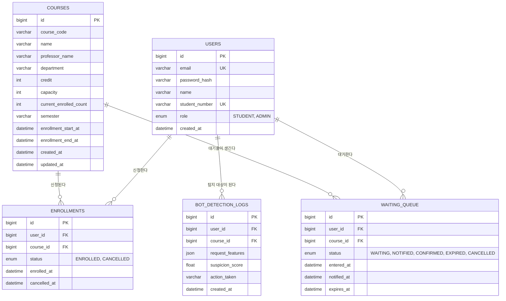

# EnrollGate — ERD & API 명세서

> Status: Draft v0.1 (PRD v0.1 기준)

---

## 1. ERD (Entity Relationship Diagram)



> `WAITING_QUEUE` 테이블은 **감사 로그/이력용**입니다. 실시간 순번 관리는 Redis Sorted Set(`queue:{courseId}`, score = 진입 timestamp)이 담당하고, DB에는 진입/알림/확정/만료 시점만 기록합니다.

---

## 2. 테이블별 설계 노트

### 2.1 `courses.current_enrolled_count`
- `enrollments` 테이블을 매번 COUNT 하지 않고 비정규화된 카운터를 유지
- 신청/취소 시 `capacity`와 비교하여 원자적으로 증감 (비관적 락 `SELECT ... FOR UPDATE` 또는 Redis `INCR`+검증 방식 중 아키텍처 단계에서 선택)
- 이 카운터가 프로젝트의 핵심 동시성 제어 지점

### 2.2 `enrollments` 유니크 제약
- `(user_id, course_id)` 조합에 **`unique(user_id, course_id)` 단순 제약으로 확정** — 취소 후 재신청은 허용하지 않는다.
- 서비스 계층에서도 `status` 무관하게 동일 (user, course) 조합의 기존 행 존재 여부로 재신청을 막는다 (`EnrollmentRepository.existsByUserIdAndCourseId`). `status = ENROLLED`만 확인하면 취소 후 재신청 시도가 이 DB 제약에 막혀 500 에러로 새는 문제가 있어, 상태와 무관하게 막도록 구현했다.

### 2.3 `waiting_queue.status` 흐름
```
WAITING → NOTIFIED → CONFIRMED (성공)
                   → EXPIRED   (시간 내 미확정, 다음 순번에게 이전)
WAITING → CANCELLED (학생이 자진 이탈)
```

### 2.4 인덱스 설계
| 테이블 | 인덱스 | 목적 |
|---|---|---|
| courses | (semester, department) | 학기별/학과별 과목 조회 |
| enrollments | (user_id) | 내 신청 내역 조회 |
| enrollments | (course_id, status) | 과목별 신청자 수 집계 |
| waiting_queue | (course_id, entered_at) | 대기열 순서 조회 (DB 폴백용) |
| waiting_queue | (user_id, course_id) | 중복 대기열 진입 방지 |

---

## 3. API 명세

Base URL: `/api/v1`
인증 방식: JWT (Authorization: Bearer {token})

### 3.1 인증

| Method | Endpoint | 설명 | 인증 |
|---|---|---|---|
| POST | `/auth/signup` | 회원가입 | X |
| POST | `/auth/login` | 로그인, JWT 발급 | X |
| POST | `/auth/refresh` | 토큰 갱신 | O |

### 3.2 과목 조회

| Method | Endpoint | 설명 | 인증 |
|---|---|---|---|
| GET | `/courses?semester={sem}&department={dept}` | 과목 목록 조회 (잔여 정원 포함) | O |
| GET | `/courses/{courseId}` | 과목 상세 조회 | O |

**GET /courses 응답 예시**
```json
{
  "courses": [
    {
      "id": 101,
      "courseCode": "CSE401",
      "name": "데이터베이스시스템",
      "professorName": "김OO",
      "department": "컴퓨터공학과",
      "credit": 3,
      "capacity": 40,
      "currentEnrolledCount": 40,
      "remainingSeats": 0,
      "semester": "2026-2",
      "queueLength": 23
    }
  ]
}
```

### 3.3 수강신청 (핵심)

| Method | Endpoint | 설명 | 인증 |
|---|---|---|---|
| POST | `/courses/{courseId}/enroll` | 수강신청 시도 | O |
| DELETE | `/enrollments/{enrollmentId}` | 신청 취소 | O |
| GET | `/enrollments/me` | 내 신청 내역 조회 | O |

**POST /courses/{courseId}/enroll — 응답 분기**

- **정원 여유 있음 → 201 Created**
```json
{
  "status": "ENROLLED",
  "enrollmentId": 5501,
  "enrolledAt": "2026-07-11T10:00:03Z"
}
```

- **정원 초과 → 202 Accepted (대기열 진입)**
```json
{
  "status": "QUEUED",
  "queuePosition": 24,
  "estimatedWaitSeconds": 180,
  "queueStatusUrl": "/api/v1/courses/101/queue/status"
}
```
> **1단계 구현 노트**: WebSocket이 아직 없어 `websocketUrl` 대신 폴링용 `queueStatusUrl`을 내려준다. `websocketUrl` 필드는 2단계에서 WebSocket 도입 시 추가된다.

- **이미 신청됨 → 409 Conflict**
```json
{
  "error": "ALREADY_ENROLLED"
}
```

### 3.4 대기열 (WebSocket 기반)

| Method/Protocol | Endpoint | 설명 | 인증 |
|---|---|---|---|
| WS | `/ws/queue/{courseId}` | 대기열 순번 실시간 push | O (연결 시 토큰 검증) |
| POST | `/courses/{courseId}/queue/confirm` | 순번 도달 후 신청 확정 | O |
| DELETE | `/courses/{courseId}/queue` | 대기열 자진 이탈 | O |
| GET | `/courses/{courseId}/queue/status` | (폴백용) 현재 순번 조회 | O |

**WebSocket 메시지 예시 (서버 → 클라이언트)**
```json
// 순번 갱신
{ "type": "POSITION_UPDATE", "position": 12, "estimatedWaitSeconds": 90 }

// 본인 차례 도달
{ "type": "YOUR_TURN", "confirmDeadline": "2026-07-11T10:05:00Z", "confirmUrl": "/courses/101/queue/confirm" }

// 시간 초과로 만료
{ "type": "EXPIRED" }
```

> WebSocket 연결이 여러 서버 인스턴스에 분산될 경우, 서버 간 순번 이벤트 동기화를 위해 Redis Pub/Sub 연동이 필요합니다 (아키텍처 설계 단계에서 구체화).

### 3.5 관리자

| Method | Endpoint | 설명 | 인증 | 상태 |
|---|---|---|---|---|
| POST | `/admin/courses` | 과목 등록 | Admin | 구현 완료 |
| PATCH | `/admin/courses/{courseId}` | 정원/정보 수정 (부분 수정, null 필드는 유지) | Admin | 구현 완료 |
| GET | `/admin/dashboard/stats` | 실시간 신청 현황 (TPS, 대기열 길이 등) | Admin | 미구현 (2단계: 부하테스트/메트릭 계측 이후) |
| GET | `/admin/bot-detection/logs` | 이상 탐지 로그 조회 (최신 50건) | Admin | 구현 완료 (4단계) |

> 관리자 계정은 회원가입 API로 만들 수 없다 (`/auth/signup`은 항상 `STUDENT`로 생성). 1단계에서는 관리자 계정을 DB에 직접 시딩하는 것을 전제로 한다 — 계정 발급/승격 플로우는 아직 범위 밖이다.

### 3.6 공통 에러 응답 포맷
```json
{
  "error": "ERROR_CODE",
  "message": "사람이 읽을 수 있는 설명",
  "timestamp": "2026-07-11T10:00:00Z"
}
```

| 에러 코드 | 상황 |
|---|---|
| `ALREADY_ENROLLED` | 이미 신청한 과목 재신청 시도 |
| `ENROLLMENT_PERIOD_CLOSED` | 신청 기간이 아님 |
| `QUEUE_CONFIRM_EXPIRED` | 확정 시간 초과 |
| `UNAUTHORIZED` | 인증 실패 |
| `SUSPICIOUS_ACTIVITY` | 봇 탐지로 인한 차단 |

---

## 4. 다음 단계에서 확정할 것 (아키텍처 설계 단계로 이관)

- [x] 정원 카운터 동시성 제어 방식: **1단계는 비관적 락으로 확정** (`CourseRepository.findByIdForUpdate`). Redis 원자 연산/분산 락은 2단계에서 A/B 비교
- [ ] WebSocket 멀티 인스턴스 환경에서의 이벤트 동기화 방식 (Redis Pub/Sub) — 2단계, WebSocket 도입 시 결정
- [x] 재신청 허용 여부에 따른 `enrollments` 유니크 제약 최종 확정: **재신청 미허용**으로 확정, `unique(user_id, course_id)` 적용
- [x] 확정 대기 시간(60초) 내 미확정 시 다음 순번 이전 로직의 트리거 방식: **스케줄러로 확정** (`QueueExpirySweeper`, 5초 주기)
